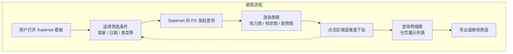
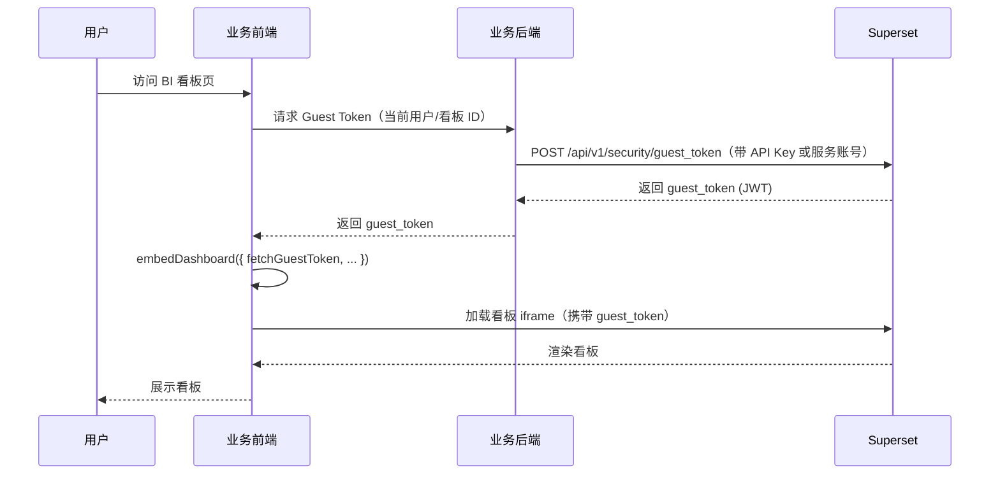
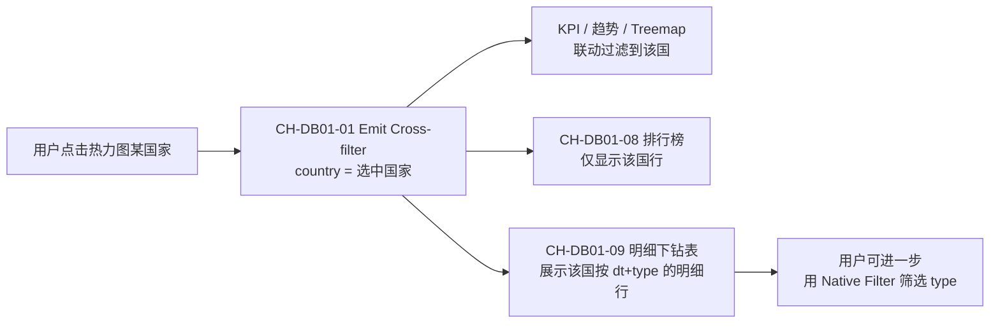

# BI 展示技术方案（Superset + PostgreSQL）

## 文档信息

| 项目 | 说明             |
|------|----------------|
| 文档版本 | 1.0            |
| 创建日期 | 2026-02-03     |
| 文档状态 | 评审中            |
| 适用范围 | 地理空间数据采集 BI 展示 |

## 修订历史

| 版本 | 日期 | 修订人 | 修订说明 |
|------|------|--------|----------|
| 1.0 | 2026-02-03 | - | 初稿，整体架构与详细设计 |
| 1.1 | 2026-03-03 | - | 采集覆盖总览看板：下线「各类型采集量折线对比」图表，附录 B.1 图表数改为 7 张、布局去掉 ROW_2 |
| 1.2 | 2026-03-03 | - | 将 DS02（gadm_country_boundary 单表）合并入 DS01；覆盖热力与国家边界面统一使用 DS01，删除 DS02 数据集规划 |
| 1.3 | 2026-03-04 | - | DB01 新增 CH-DB01-09 采集明细下钻表，加入 ROW_2；CH-DB01-01 使用 deck_polygon 类型 |
| 1.4 | 2026-03-04 | - | 实施 B.1.5 看板布局：创建 CH-DB01-10（chartId=122）和 CH-DB01-09（chartId=123, table），更新看板 position_json（ROW_2）和 json_metadata（chartsInScope 加入 122、123） |
| 1.5 | 2026-03-04 | - | CH-DB01-10 从 `country_map` 改为 `deck_geojson`：country_map 的 select_country 为静态参数无法被 Cross-filter 动态切换；改用 deck_geojson 渲染 DS-DB01-01 的 geojson 列（`ST_AsGeoJSON(g.geom)`），筛选国家后自然只显示对应国家边界 |
| 1.6 | 2026-03-04 | - | 国家详情地图不显示修复：① 图表 122 底图由 `mapbox://styles/mapbox/light-v11` 改为 OSM（`https://tile.openstreetmap.org/{z}/{x}/{y}.png`），避免未配置 MAPBOX_API_KEY 时底图空白；② DS-DB01-01 的 geojson 列改为标准 GeoJSON Feature 格式（`json_build_object('type','Feature','geometry',ST_AsGeoJSON(g.geom)::json,'properties',...)::text`）以兼容 deck.gl 渲染 |
| 1.7 | 2026-03-04 | - | 需求：未选国家时国家详情地图与采集明细下钻表保持为空；在 B.1.5 实施要点后增加实现说明与手动步骤（专用 Virtual Dataset + `filter_values('country')` Jinja，无选中国家时 WHERE 1=0） |
| 1.8 | 2026-03-06 | - | 根据「采集覆盖总览-V1」实际运行看板更新：① 完善 DS01 虚拟数据集 SQL (ID 69)；② 更新图表 126 (deck_polygon) 与 123 (table) 配置；③ 同步最新三栏式对齐布局 |
| 1.9 | 2026-03-06 | - | 结构重构：① B.2 道路热力看板定号为 DB02 (Dashboard 19)；② B.3 POI 热力看板定号为 DB03 (Dashboard 20)；③ B.4 人口热力看板定号为 DB04 (Dashboard 22)；④ 统一所有主题为复合对齐布局模式；⑤ 补全各看板图表规划 |
| 1.10 | 2026-03-06 | - | 全面审查：① 更新 4.6.2 数据集表格添加 DS02/03/04 虚拟数据集；② 更新 4.6.4.1 添加实际 Dashboard ID；③ 统一 4.6.4.2 布局说明为通用模式；④ 移除口语化表述，规范文档格式 |
| 1.11 | 2026-03-06 | - | 命名规范调整：① 图表 126 保留「瓦片」二字；② 数据集 30/31 重命名为 ds_osm_road_length/ds_osm_road_length_all；③ 清理废弃的 CH-DB01-10（国家详情地图）相关描述；④ 更新 B.1 章节以匹配实际运行的看板配置 |
---

## 目录

| 章节 | 内容 |
|------|------|
| 1. 概述 | 摘要、背景、目标 |
| 2. 现状与需求分析 | 数据主存与 PG 资产、需求匹配结论 |
| 3. 总体方案 | 方案结论、技术选型、总体架构、数据流概览 |
| 4. 详细设计 | 数据层、同步策略、展示能力、性能与索引、权限；Superset 平台设计（部署/数据集/图表/看板）；前端集成（Embedded SDK） |
| 5. 实施计划与里程碑 | 阶段与产出 |
| 6. 风险与对策 | 风险项与对策 |
| 7. 交付物 | 交付清单 |
| 附录 A：数据源表信息说明（外链） |
| 附录 B：看板详细实施规划（DB01~DB04） | DB01~DB04 详细实施规划 |

---

## 1. 概述

### 1.1 摘要
本方案针对地理空间数据采集场景，提出基于 **Superset + PostgreSQL** 的 BI 展示方案：以腾讯云 DLC/Iceberg 为数据主存，通过定时同步将聚合与维表落 PG，由 Superset 连接 PG 实现全球热力图、区域下钻及多主题分析，无需自研前端。

### 1.2 背景
- 采集数据已落入腾讯云 DLC 的 Iceberg 表，但难以直观查看**采集覆盖范围**与**各地区数据量**。
- 业务需要：全球热力图等整体展示，支持点选区域下钻到明细数据。

### 1.3 目标
- 提供全球范围的覆盖热力展示（国家/省市/H3/瓦片）。
- 支持区域下钻查看明细数据。
- 优先复用现有数据资产与计算产物，减少前端开发。

---

## 2. 现状与需求分析

### 2.1 数据主存（DLC/Iceberg）
- DLC 流处理作业已将数据写入 Iceberg 原生表，支持按 `dt` 分区与动态多表路由。
- Iceberg 表字段包含 `satellite_meta`、`country`、`source`、`ext`、`dt` 等，满足基础维度统计。
- **问题**：直接对 DLC 做 BI 查询需依赖 Spark 等引擎，接入与性能成本高；业务更希望用成熟 BI 工具快速出图。

### 2.2 PG 已有数据资产
数据人员已通过 DLC 作业将多类结果表同步至 PostgreSQL，可作为 BI 数据源。核心表与结构详见《20260203_BI展示技术方案_crawler_db数据源调研.md》。按表结构可归纳为：

| 类型 | 说明 | 代表表 | 典型用途 |
|------|------|--------|----------|
| **带 geometry 的表** | 含 `geom`/`extent`/`bbox`，可做地图、热力、点/面图层 | `gadm_country_boundary`、`geoboundaries_org_country_boundary`、`satellite_images`（extent）、`dem_tiles_data`、`gps_trace_data`、`street_views`（geom/bbox）、`o_road`、`o_node`、`o_relation` | 全球/国家边界图、瓦片覆盖热力、轨迹/街景点图 |
| **按国家/维度聚合的统计表** | 无几何，有 `country`/`country_code` + 指标列，需与维表/边界表 JOIN 上图 | `crawler_tile_all`（country, type, dt, count_nums）、`app_osm_road_length`、`app_foursquare_places_d`、`app_osm_address_info`、`dws_osm_road_network_density`、`road_overture_osm_compare_m` 等 | 按国家着色热力、柱状/饼图、趋势图 |
| **维表/字典表** | 主键 + 名称/编码，用于关联与筛选 | `dim_country`、`dim_country_name`、`dim_province`、`dim_osm_country_relation`、`dim_osm_poi_info` | 筛选器、下钻层级、名称展示 |

### 2.3 需求匹配结论
- **热力图**：已有 `crawler_tile_all`（country, type, dt, count_nums）可做按国家+类型的覆盖统计；边界表 `gadm_country_boundary`（geom, country_code3/country_code2）可做国家面着色；`satellite_images`（extent）、`dem_tiles_data`（geom）可做瓦片级覆盖展示。
- **下钻**：维表 `dim_osm_country_relation`（area_name_en/cn, parent_id, adm_level）支持国家→省市级下钻；明细表 `satellite_images`、`o_road`、`gps_trace_data` 等可按国家/时间过滤做明细列表。
- **缺省**：若需 H3 网格级热力或瓦片级聚合，可补充 `bi_coverage_h3` / `bi_coverage_tile`；当前表结构已可支撑国家级热力与多主题统计。

---

## 3. 总体方案

### 3.1 方案结论
**采用 Superset 作为展示层、PostgreSQL 作为 BI 加速层是可行且推荐的。**
- DLC/Iceberg 作为主存，保留明细与长期存储能力。
- PG 仅承载聚合表、维表及可选明细，为 Superset 提供稳定、低延迟查询。
- Superset 通过 JDBC 连接 PG，配置数据集与看板，实现热力图与下钻，无需自研前端。

### 3.2 技术选型

| 层次 | 选型 | 说明 |
|------|------|------|
| 数据主存 | 腾讯云 DLC / Iceberg | 现有采集落库，按 `dt` 分区，权威数据源 |
| BI 数据层 | PostgreSQL | 已有大量表落 PG，支持 PostGIS，易与 Superset 集成 |
| 展示层 | Apache Superset | 开源 BI，支持地图/热力/下钻，JDBC 连 PG |

### 3.3 总体架构
#### 3.3.1 架构说明
采用「**数据湖主存 + PG 加速层 + Superset 展示**」分层架构：

1. **数据主存层（DLC/Iceberg）**：采集与流处理结果写入 Iceberg 表，按 `dt` 分区，作为原始数据与明细的权威来源。
2. **同步与聚合层**：定时批处理（Spark SQL / ETL）将 DLC 的聚合结果、维表及部分明细同步至 PostgreSQL，仅落展示所需数据量。
3. **BI 数据层（PostgreSQL）**：存放聚合表、维表及可选明细，为 Superset 提供稳定、低延迟查询；通过 `dt` 分区/索引优化热力图与下钻。
4. **展示层（Superset）**：JDBC 连接 PG，配置数据集与看板，实现全球热力图、区域下钻、多主题分析（覆盖、道路、POI、人口等）。

权限与数据隔离：PG 侧通过 RLS/视图控制；Superset 侧通过行级权限配合。

#### 3.3.2 业务流程图

**数据到看板流程**：从采集落库到 BI 展示的端到端数据流。


**用户使用看板流程**：打开看板、筛选、看图、下钻查看明细。



### 3.4 数据流概览
**采集/DLC 写入 → DLC Iceberg 表 → 批处理同步 → PostgreSQL → Superset 查询与展示 → 用户。**

---

## 4. 详细设计

本节基于《20260203_BI展示技术方案_crawler_db数据源调研.md》编写，表名字段与现有库表一致。

### 4.1 数据层设计

#### 4.1.1 数据组织原则
- **优先用现有聚合表**：如 `crawler_tile_all`（country, type, dt, count_nums）、`app_osm_road_length`、`app_foursquare_places_d` 等已按国家/类型/日期聚合，直接供图表与筛选使用。
- **带 geometry 的表**：用于地图/热力图层时，需在 Superset 中配置 PostGIS 数据源与几何列（如 `gadm_country_boundary.geom`、`satellite_images.extent`）；统计表与边界表通过 `country_code`/`country_code2`/`country_code3` 关联后上图。
- **明细表**：`satellite_images`、`o_road`、`gps_trace_data`、`street_views` 等用于下钻列表时，建议按 `country`/时间范围限制行数或做分页。

#### 4.1.2 现有表满足情况与可选补充
| 展示需求 | 现有表是否满足 | 说明 |
|----------|----------------|------|
| 国家级覆盖热力 | 满足 | `crawler_tile_all`(country, type, dt, count_nums) + `gadm_country_boundary`(geom, country_code3) 关联即可 |
| 瓦片/影像覆盖分布 | 满足 | `satellite_images`(extent, coordinate_z/x/y)、`dem_tiles_data`(geom, tile_id, level) 可直接做点/面图层 |
| 道路/POI/地址等按国家统计 | 满足 | `app_osm_road_length`、`app_osm_road_length_all`、`app_foursquare_places_d`、`app_osm_address_info` 等已有 country/country_code + 指标 |
| 国家→省市级下钻 | 满足 | `dim_osm_country_relation`(area_name_en/cn, parent_id, adm_level) 提供层级；统计表按 country 过滤 |
| H3 网格级热力 | 需补充 | 现有表无 h3_index；若需要可新增 `bi_coverage_h3`(dt, h3_resolution, h3_index, count_total) 由批处理产出 |

仅当需要 **H3 网格粒度** 热力时，再补充 `bi_coverage_h3`；其余场景用现有表即可。

#### 4.1.3 Superset 数据集规划（按表结构）
| 用途 | 数据来源 | 关键字段与关联 |
|------|----------|-----------------|
| **覆盖热力（按国家）与边界底图** | DS01（Virtual Dataset：`crawler_tile_all` + `gadm_country_boundary` JOIN） | 同一数据集提供 geom（边界几何）与 count_nums（着色指标）；以 `country` 与 `country_code3` 关联；过滤：type、dt；原 DS02 已合并入 DS01 |
| **瓦片/影像覆盖** | `satellite_images`、`dem_tiles_data` | 几何：satellite_images.extent、dem_tiles_data.geom；可按 coordinate_z 或 level 分层 |
| **道路/POI/地址等统计图** | `app_osm_road_length`、`app_osm_road_length_all`、`app_foursquare_places_d`、`app_osm_address_info` 等 | 维度：country/country_code、mo/date_refreshed、road_subtype/level1_category 等；指标：road_length_km、poi_count、count_nums；与维表 JOIN 取名称 |
| **道路/OSM 对比** | `road_overture_osm_compare_m` | 维度：country；指标：overture_total、osm_total、matched_count、match_rate |
| **明细下钻** | `satellite_images`、`o_road`、`gps_trace_data`、`street_views` | 按看板筛选器 country、时间范围限制；分页查询；几何列用于地图点/线 |
| **筛选器/下钻层级** | `dim_country`、`dim_country_name`、`dim_province`、`dim_osm_country_relation`、`dim_osm_poi_info` | 作为维度表与统计表 JOIN，或单独做筛选数据集 |

### 4.2 同步与刷新策略
- **日级批处理**：每日将 DLC 聚合结果/维表同步至 PG。对含 `dt`/`mo`/`date_refreshed` 的表（如 `crawler_tile_all`、`app_osm_road_length`、`app_foursquare_places_d`）按日期覆盖或追加；对维表（如 `dim_country`、`dim_osm_country_relation`）可全量刷新。
- **幂等与主键**：同步需与各表主键/唯一约束一致（如 `app_osm_road_length`(mo, country_code, road_subtype)、`app_foursquare_places_d`(country_alpha3, date_refreshed, is_closed, level1_category_id, level1_category_name)），避免重复与全表扫描。
- **明细表**：`satellite_images`、`o_road`、`gps_trace_data` 等若从 DLC 同步，建议按 `country` + 时间范围增量，或仅保留近 N 天供下钻。

### 4.3 展示能力设计
- **带几何的表**：`gadm_country_boundary`、`satellite_images`（extent）、`dem_tiles_data`、`gps_trace_data`、`street_views` 等可直接在 Superset 中配置为地图图层（面/点/线）；几何列分别为 geom、extent、geom、geom、geom/bbox。
- **纯统计表**：`crawler_tile_all`、`app_osm_road_length`、`app_foursquare_places_d` 等无几何列，需与 `gadm_country_boundary` 或 `dim_country` 按 country_code/country_code3 关联后，再以“按国家着色”方式上地图；或做柱状/饼图/趋势图。
- **下钻方式**：图表联动 → 过滤器（country、dt、mo）变化 → 刷新明细表；或通过 `dim_osm_country_relation` 的 parent_id/adm_level 实现国家→省市级下钻；明细表（satellite_images、o_road、gps_trace_data、street_views）分页展示。

### 4.4 性能与索引
- **已有索引**（详见《20260203_BI展示技术方案_crawler_db数据源调研.md》）：边界表已建 `geom`(GIST)、`country_code3`/`country_name`；`crawler_tile_all`、`app_*` 等统计表多为按主键/唯一键查询；`satellite_images` 有 `udx_tile_z_x_y`、`extent`(GIST)；`gps_trace_data` 有 `trace_id`、`geom`(GIST)、`crawl_time`。Superset 查询应尽量带 `country`/`dt`/`mo` 等过滤以利用索引。
- **明细表**：`satellite_images`、`o_road`、`gps_trace_data`、`street_views` 等下钻列表需限制行数或分页，避免全表扫描。
- **Superset**：合理使用缓存与查询超时/限流；地图图层可对几何做简化或按视野范围裁剪。

### 4.5 权限与安全
- **PostgreSQL**：通过 RLS 或视图按国家/来源做行级隔离；敏感字段可做脱敏或权限视图。
- **Superset**：配置角色与行级权限（RLS），与 PG 权限模型对齐。

### 4.6 Superset 平台设计

本节给出 Superset 的部署方式（本地 Docker Compose 测试、生产 K8s）、数据集（Datasets）清单、图表（Charts）类型与配置、看板（Dashboards）组成与布局及数据联动方式，便于实施与运维。

#### 4.6.1 部署方案

##### 4.6.1.1 本地 Docker Compose 部署（测试）

用于本地或测试环境快速启动 Superset，连接已有 PostgreSQL（或同 compose 内 PG）。

**目录与文件**：建议在项目下建 `superset/docker-compose.yml` 及可选 `superset/.env`。

**docker-compose.yml 示例**：

```yaml
services:
  superset:
    image: apache/superset:6.0.0-dev
    container_name: superset
    restart: unless-stopped
    env_file:
      - .env
    ports:
      - "8088:8088"
    volumes:
      - superset_home:/app/superset_home
      - superset_config:/app/superset_config
    networks:
      - maptech
    command: >
      sh -c "
        superset db upgrade &&
        superset fab create-admin --username admin --firstname Admin --lastname User --email admin@example.com --password admin || true &&
        superset init &&
        gunicorn --bind 0.0.0.0:8088 --access-logfile - --error-logfile - --workers 4 --worker-class gthread --threads 20 --timeout 120 'superset.app:create_app()'
      "

volumes:
  superset_home:
  superset_config:

networks:
  maptech:
    driver: bridge
```

**.env 示例**：

```dotenv
# Flask 密钥，用于加密会话和 CSRF 令牌，长度至少 32 位
SUPERSET_SECRET_KEY=K7Gqn27vwQD1lHknch0Qm8AA9xVbYa6MqCVynZ2eqNelINtnWNFCFowez8riXmCa

SUPERSET_LOAD_EXAMPLES=yes
SUPERSET_WEBSERVER_PORT=8088

# Superset 元数据库配置
# PostgreSQL 数据库类型
DATABASE_DIALECT=postgresql
DATABASE_HOST=127.0.0.1
DATABASE_PORT=5432
DATABASE_DB=superset
DATABASE_USER=superset
DATABASE_PASSWORD=xxxxxxxxxxxxxxxx

# Redis 缓存配置
REDIS_HOST=127.0.0.1
REDIS_PORT=6379
```


**说明**：

1. **PostgreSQL 配置**：
   - 用于存储 Superset 元数据（用户、角色、仪表板配置等）
   - 建议使用独立数据库实例或与业务数据同集群不同库
   - 生产环境需配置强密码并启用 SSL
   - `DATABASE_NAME` 需提前创建好数据库

2. **Redis 缓存配置**：
   - 用于加速查询结果、仪表板渲染和异步任务处理
   - 生产环境建议启用密码认证和持久化
   - 与 Superset 应用保持低延迟网络连接
   - 可与现有 Redis 集群复用，也可单独部署


##### 4.6.1.2 生产 K8s 部署方案

生产环境建议将 Superset 部署在 Kubernetes，与现有 PG 同网或可访问，并配置 Ingress、资源限制与密钥管理。

**资源清单要点**：

| 资源类型 | 说明 |
|----------|------|
| **Deployment** | Superset 应用，单副本或多副本；镜像 `apache/superset:latest` 或自建 tag；环境变量从 ConfigMap/Secret 注入；挂载 `superset_config.py`（ConfigMap）及可选 `superset_home`（PVC）。 |
| **Service** | ClusterIP 或 NodePort，暴露 8088；若需异步任务再部署 Celery Worker + Beat。 |
| **ConfigMap** | `superset_config.py` 片段（如 FEATURE_FLAGS、CACHE 配置、MAPBOX_TOKEN 等）、非敏感配置。 |
| **Secret** | `SUPERSET_SECRET_KEY`、数据库连接串（或单独 DB Secret）、Redis 密码等。 |
| **Ingress** | 对外暴露 HTTPS，域名如 `superset.xxx.com`；配置 TLS 与后端 Service。 |
| **PVC** | 可选，用于 `superset_home` 持久化（上传文件、日志等）。 |

**典型配置**：

- **数据库**：`SQLALCHEMY_DATABASE_URI` 使用 K8s Secret 中的连接串，指向 Superset 元数据库（可与 BI 业务 PG 同集群不同库）。
- **Redis**：若集群内已有 Redis，`REDIS_HOST`/`CELERY_BROKER_URL`/`DATA_CACHE_CONFIG` 指向该服务；否则单独部署 Redis 或使用云厂商 Redis。
- **Celery**（可选）：需定时刷新缓存或异步查询时，部署 Celery Worker + Beat，与 Web 共用 `CELERY_BROKER_URL` 与 Superset 配置。
- **资源**：建议 request/limit 如 `memory: 1Gi`、`cpu: 500m` 起步，按压测调整。
- **健康检查**：liveness/readiness 探针指向 `:8088/health` 或 `:8088/api/v1/`。

**数据源**：在 Superset 中配置的「Database」指向业务 PG（表清单与结构详见《20260203_BI展示技术方案_crawler_db数据源调研.md》），连接信息建议存 K8s Secret，通过环境变量或 init 脚本注入；或由运维在 Superset 界面一次性配置并导出为备份。

---

#### 4.6.2 数据集（Datasets）

Superset 中「Dataset」对应一个可查询的物理表或虚拟 SQL，用于生成图表。下表列出建议创建的数据集、来源类型（表 / SQL）、主要字段及用途。

| 序号 | 数据集名称（逻辑标识） | 实际表名 | 来源类型 | 来源（表名或 SQL 说明） | 主要字段/说明 | 用途 |
|------|-------------------|----------|----------|--------------------------|----------------|------|
| DS01 | ds_db01_coverage_world_map (ID: 69) | crawler_coverage_polygon_v2 | SQL | crawler_tile_all + gadm_country_boundary JOIN | country_code3, **country**, country_name, **geojson**, crawl_count | 覆盖热力图核心数据集。使用 ST_Simplify(geom, 0.1) 提升渲染性能。 |
| DS02 | ds_road_coverage_world_map (ID: 70) | ds_road_coverage_world_map | SQL | app_osm_road_length + gadm_country_boundary JOIN | country_code3, **country**, country_name, **geom**, total_road_length | 道路热力图数据集。使用 ST_Simplify(geom, 0.1) 提升渲染性能。 |
| DS03 | ds_poi_coverage_world_map (ID: 71) | ds_poi_coverage_world_map | SQL | app_foursquare_places_d + gadm_country_boundary JOIN | country_code3, **country**, country_name, **geom**, total_poi_count | POI 热力图数据集。使用 ST_Simplify(geom, 0.1) 提升渲染性能。 |
| DS04 | ds_population_coverage_world_map (ID: 72) | ds_population_coverage_world_map | SQL | dw_osm_population_info + gadm_country_boundary JOIN | country_code3, **country**, country_name, **geom**, total_population | 人口热力图数据集。使用 ST_Simplify(geom, 0.1) 提升渲染性能。 |
| DS05 | ds_crawler_tile_all | crawler_tile_all | Table | crawler_tile_all | country, type, dt, count_nums | 覆盖统计柱状/趋势 |
| DS06 | ds_satellite_images | satellite_images | Table | satellite_images | id, file_path, coordinate_z, coordinate_x, coordinate_y, extent, provider, capture_date | 影像覆盖点/面、下钻 |
| DS07 | ds_dem_tiles | dem_tiles_data | Table | dem_tiles_data | id, tile_id, level, geom, source_name | DEM 覆盖点/面 |
| DS08 | ds_osm_road_length | app_osm_road_length | Table | app_osm_road_length | mo, country_code, road_subtype, road_length_km | 道路长度柱状/趋势 |
| DS09 | ds_osm_road_length_all | app_osm_road_length_all | Table | app_osm_road_length_all | mo, country_code, open_road, close_road, total_road | 道路全量趋势 |
| DS10 | ds_foursquare_poi | Table | app_foursquare_places_d | country_alpha3, date_refreshed, level1_category_name, poi_count, is_closed | POI 柱状/饼图/趋势 |
| DS11 | ds_osm_address | Table | app_osm_address_info | country, count_nums | 地址统计 |
| DS12 | ds_road_compare | Table | road_overture_osm_compare_m | country, overture_total, osm_total, matched_count, match_rate | Overture vs OSM 对比 |
| DS13 | ds_population | Table | dw_osm_population_info | country, countryname, provincename, population, sourcepop | 人口统计 |
| DS14 | ds_overture_population | Table | overture_area_population | country, subtype, subtype_cn, area, population | Overture 区域人口 |
| DS15 | ds_country_dim | Table | dim_country | id, alpha2_code, alpha3_code, short_name, full_name | 筛选器/名称解析 |
| DS16 | ds_osm_country_relation | Table | dim_osm_country_relation | id, area_name_en, area_name_cn, parent_id, adm_level, country_code_alpha2 | 下钻层级/筛选 |
| DS17 | ds_satellite_detail | SQL | 见下方 SQL | 下钻明细，带分页限制 | 下钻列表 |

**DS01（覆盖热力与边界合一）**：`crawler_tile_all` + `gadm_country_boundary` JOIN，同时提供 **geom**（国家边界面）与覆盖指标；原 DS02 已合并入，不再单独建边界数据集。SQL、输出列、Superset 配置等详见**附录 B.1.3.1**。

**DS15（卫星影像下钻明细，限制行数）SQL 示例**：

```sql
SELECT id, file_path, coordinate_z, coordinate_x, coordinate_y, provider, resolution, capture_date, extent
FROM satellite_images
WHERE 1=1
  AND (CASE
    WHEN TRIM('{{ date_from }}') = '' OR TRIM('{{ date_from }}') = '{{ date_from }}' THEN true
    ELSE capture_date >= (TRIM('{{ date_from }}'))::timestamptz
  END)
  AND (CASE
    WHEN TRIM('{{ date_to }}') = '' OR TRIM('{{ date_to }}') = '{{ date_to }}' THEN true
    ELSE capture_date <= (TRIM('{{ date_to }}'))::timestamptz
  END)
ORDER BY capture_date DESC
LIMIT 1000
```

（`date_from`、`date_to` 由看板 Native Filter 传入。说明：`satellite_images` 表无 `country` 列，若需按国家过滤，需与边界表做空间 JOIN，例如 `JOIN gadm_country_boundary g ON ST_Intersects(satellite_images.extent, g.geom) AND g.country_code3 = '{{ country }}'`，并注意性能与行数限制。）

---

#### 4.6.3 图表（Charts）

下表列出建议创建的图表、类型、所用数据集、配置要点及可选 SQL。

| 图表 ID | 图表名称 | 图表类型 | 数据集 | 配置要点（维度/指标/过滤） | 可选 SQL / 说明 |
|---------|----------|----------|--------|----------------------------|------------------|
| CH01 | 覆盖热力-国家面 | Deck.gl - Polygon | **DS01** | 几何列：geom；颜色/权重：total_count；实体/Emit 列：country；筛选：dt, type（均来自 DS01，DS02 已合并入 DS01） | 指标选 total_count，Tooltip 可加 google_map_count、google_earth_count |
| CH02 | 覆盖量-按国家柱状 | Bar Chart | DS03 | X：country；Y：count_nums（Sum）；Group by：type；Filter：dt | — |
| CH03 | 覆盖量-按日期趋势 | Line Chart | DS03 | X：dt；Y：count_nums（Sum）；Series：country 或 type；Filter：country, type | — |
| CH04 | 卫星影像覆盖点/面 | Deck.gl - Geojson 或 Point | DS04 | 几何：extent；Tooltip：coordinate_z, provider, capture_date；Filter：country, capture_date | 数据量大时用 WHERE 限制或采样 |
| CH05 | DEM 瓦片覆盖 | Deck.gl - Polygon/Point | DS05 | 几何：geom；Tooltip：tile_id, level, source_name | — |
| CH06 | 道路长度-按国家/类型 | Bar Chart | DS06 | X：country_code；Y：road_length_km（Sum）；Group：road_subtype；Filter：mo | — |
| CH07 | 道路长度-趋势 | Line Chart | DS07 | X：mo；Y：total_road（Sum）；Series：country_code | — |
| CH08 | POI 数量-按国家/分类 | Bar Chart | DS08 | X：country_alpha3 或 level1_category_name；Y：poi_count（Sum）；Filter：date_refreshed, is_closed | — |
| CH09 | POI 分类占比 | Pie Chart | DS08 | 维度：level1_category_name；指标：poi_count（Sum）；Filter：country_alpha3, date_refreshed | — |
| CH10 | Overture vs OSM 道路对比 | Bar Chart | DS10 | X：country；Y：overture_total, osm_total, matched_count；或双轴 match_rate | — |
| CH11 | 人口分布-按国家 | Bar Chart | DS11 或 DS12 | X：country 或 countryname；Y：population（Sum）；Filter：provincename | — |
| CH12 | 卫星影像下钻明细表 | Table | DS17 | 列：id, file_path, coordinate_z, coordinate_x, coordinate_y, provider, capture_date；Filter：country, date_from, date_to；分页 | 依赖 DS17 的 Template 参数 |
| CH13 | 国家筛选器 | Filter Box / Native Filter | DS13 或 DS14 | 筛选项：country（alpha2/alpha3 或 area_name）；可多选 | 与看板其他图表联动 |

**图表类型与字段对应关系小结**：

- **Deck.gl Polygon/Geojson**：需数据集含几何列（geom/extent），选「Spatial」列做 geometry；颜色/大小可绑指标列。
- **Bar/Line/Pie**：维度选列（如 country, dt, mo），指标选聚合（Sum/Count）。
- **Table**：选列即可；过滤与分页由数据集 SQL 或 Native Filter 控制。
- **Native Filter**：绑定到维度列（如 country, dt, type），勾选「Cross-filter」后可与同看板图表联动。

---

#### 4.6.4 看板（Dashboards）与布局、数据联动

##### 4.6.4.1 看板清单与组成

| 看板 ID (实际) | 看板名称 | 用途 | 由哪些图表组成 |
|---------|----------|------|----------------|
| 18 (DB01) | 瓦片采集覆盖总览 | 全球覆盖热力、按国家/类型/日期统计、趋势、明细下钻 | CH-DB01-01, CH-DB01-02, CH-DB01-03, CH-DB01-04, CH-DB01-06, CH-DB01-08, CH-DB01-09 |
| 19 (DB02) | 道路采集覆盖总览 | 全球道路采集覆盖热力、趋势及统计 | CH-ROAD-01, CH-ROAD-02, CH-ROAD-03, CH-ROAD-04, CH-ROAD-05 |
| 20 (DB03) | POI采集覆盖总览 | 全球POI采集覆盖热力、分类占比及趋势 | CH-POI-01, CH-POI-02, CH-POI-03, CH-POI-04, CH-POI-05 |
| 22 (DB04) | 人口与综合指标 | 全球人口分布热力、区域排名及综合指标 | CH-POP-01, CH-POP-02, CH-POP-03, CH-POP-04 |


##### 4.6.4.2 布局说明

所有看板均采用 **120 高度对齐的复合布局模式**：

- **第 1 行 (核心监控区)**：左侧 KPI 栏 (w=3, h=120) + 右侧大地图 (w=9, h=120)
  - KPI 栏包含：2 个 KPI 卡片 (各 h=20) + 1 个分布图/排行榜 (h=80)
  - 地图使用 deck_polygon 类型，配置 autozoom=true

- **第 2 行 (趋势分析区)**：趋势图表 (w=12, h=50)
  - DB01：采集量按时间趋势 (Area Chart)
  - DB02：道路长度增长趋势 (Area Chart)
  - DB03：POI 采集增长趋势 (Area Chart)
  - DB04：预留扩展位置

- **第 3 行 (明细区，仅 DB01)**：排行榜 + 明细表 (w=4+8, h=60)

（Superset 网格为 12 列，可依实际拖拽微调。）

##### 4.6.4.3 数据联动

- **Native Filter 联动**：所有看板使用「Native Filter」组件，绑定维度列（如 country, dt, type, mo, date_refreshed）。在 Filter 上勾选 **Cross-filter**（或「Scoping」中勾选要联动的图表），则选择国家/日期/类型后，该看板内所有勾选联动的图表自动带相同过滤条件重新查询。  
- **图表 → 图表**：若需「点击热力图上某国家再驱动明细表」，可用 **Cross-filter**：CH-DB01-01 的维度列（如 country_code3）设为「Emit filter when clicked」，目标图表 CH-DB01-09 勾选接收该 Cross-filter；或同一看板内统一依赖同一批 Native Filter，通过筛选器联动。  
- **参数传递**：DS01/DS15 的 SQL 中 `{{ dt }}`、`{{ country }}`、`{{ date_from }}`/`{{ date_to }}` 对应 Superset 的「Filter」或「Template parameters」，在数据集「Edit」中声明参数名与类型，在看板里将 Native Filter 映射到该参数即可。

按上述步骤配置后，即可在本地 Docker Compose 验证数据源、数据集、图表与看板，再在生产 K8s 中部署同一套配置（可通过 Superset 导出/导入 YAML 或备份元数据库做迁移）。

### 4.7 前端集成（Embedded SDK）

本节说明如何将 Superset 看板**嵌入到业务前端**，实现统一导航与统一登录，用户无需单独访问 Superset 或二次登录。采用 **Superset Embedded SDK** 方式，由业务后端签发 **Guest Token**，前端通过 SDK 挂载看板 iframe 并完成鉴权。

#### 4.7.1 选型说明

| 方式 | 说明 | 与本方案 |
|------|------|----------|
| **Embedded SDK** | 使用 `@superset-ui/embedded-sdk` 在前端页面挂载仪表盘，后端提供 Guest Token，SDK 负责 iframe 与鉴权 | **已采用** |
| iframe 直嵌 | 直接 iframe 嵌 Superset 看板 URL，需单独解决登录或带参 URL | 不采用 |

采用 Embedded SDK 后，看板作为业务前端的一个**路由/区块**呈现，导航、布局、登录体系由业务系统统一管理，仅图表区域由 Superset 渲染。

#### 4.7.2 鉴权与 Guest Token 流程



- **业务后端**：在用户访问 BI 看板页时，根据当前登录用户与要展示的看板 ID，向 Superset 的 `POST /api/v1/security/guest_token` 发起请求（需使用具备 `can_grant_guest_token` 权限的 Superset 账号或 API Key），获取 JWT 格式的 `guest_token`，再下发给前端。
- **业务前端**：使用 Embedded SDK 的 `embedDashboard`，在 `fetchGuestToken` 回调中调用后端接口取得 `guest_token` 并返回；SDK 会将 token 传给 Superset 的 iframe，完成嵌入式鉴权，用户无需在 Superset 登录。

#### 4.7.3 前端集成步骤

**1. 安装依赖**

```bash
npm install --save @superset-ui/embedded-sdk
```

**2. 封装看板嵌入组件（示例）**

```javascript
import { embedDashboard } from "@superset-ui/embedded-sdk";

export function embedBiDashboard(options) {
  const {
    dashboardId,
    supersetDomain,
    mountPoint,
    fetchGuestToken,
    hideTitle = true,
    hideTab = true,
    hideChartControls = false,
  } = options;

  return embedDashboard({
    id: dashboardId,
    supersetDomain,
    mountPoint,
    fetchGuestToken,
    dashboardUiConfig: {
      hideTitle,
      hideTab,
      hideChartControls,
      filters: { expanded: true },
      urlParams: {},
    },
  });
}
```

**3. 页面使用示例**

- 在业务前端的「BI 看板」路由下，预留一个容器节点（如 `div#superset-dashboard-root`）。
- 页面加载时：先调用业务后端接口获取 Guest Token（后端再请求 Superset `/api/v1/security/guest_token`），再调用 `embedBiDashboard`，将 `mountPoint` 指向该容器，`fetchGuestToken` 返回后端下发的 token。
- 若看板 ID 随路由变化（如 `/bi/dashboard/:id`），则根据路由参数传入对应 `dashboardId`。

**4. 后端接口职责（建议）**

- 提供接口例如 `GET /api/bi/guest_token?dashboard_id=xxx`。
- 校验当前用户是否有权查看该看板（可选：与业务角色/权限中心对齐）。
- 使用具备 `can_grant_guest_token` 的 Superset 服务账号或 API Key，向 Superset 请求 Guest Token（请求体包含 `user`、`resources`、`rls` 等，见 Superset 文档），将返回的 `token` 再返回给前端。
- 建议对 Guest Token 请求做频率限制与审计。

#### 4.7.4 Superset 侧配置

- **启用嵌入式**：在 Superset 的 `superset_config.py`（或环境变量）中开启嵌入式能力，例如：
  - `FEATURE_FLAGS = { "EMBEDDED_SUPERSET": True }`（具体 flag 名以当前 Superset 版本文档为准）。
- **Guest Token 密钥**：配置 `GUEST_TOKEN_JWT_SECRET` 或等价配置，用于签发/校验 Guest Token，需与 Superset 版本要求一致且妥善保管。
- **CORS**：若前端与 Superset 不同域，需在 Superset 侧配置允许业务前端域名（如 `WEBDRIVER_BASEURL`、CORS 白名单等，以当前版本文档为准）。
- **看板/图表权限**：在 Superset 中为「Guest」或嵌入式角色配置可访问的看板与数据集，确保 Guest Token 仅能访问允许的资源；结合 RLS 可实现行级数据隔离。

#### 4.7.5 看板与图表配色方案

- **看板级**：编辑看板 → 右上角「编辑仪表板」→ 左侧「Dashboard 属性」→ **ADVANCED** 中的 `json_metadata` 可配置：
  - `color_scheme`：如 `"supersetColors"` 或自定义方案 id（需在服务端注册）。
  - `color_scheme_domain`：看板内图表共用的颜色列表（十六进制数组），如 `["#1FA8C9","#454E7C",…]`。
  - `shared_label_colors`：按维度值固定颜色，如 `{"google_map":"#1FA8C9","google_earth":"#5AC189"}`。
  - `label_colors`：按图表/指标指定颜色，格式见 Superset 文档。
- **单图表**：编辑图表 → **Customize** / **Chart Options** → **Color Scheme** 或 **Colors** 选择/自定义色板；部分图表类型支持「指标/维度」与颜色列绑定。
- **服务端统一色板**：在 `superset_config.py` 中配置 `EXTRA_CATEGORICAL_COLOR_SCHEMES`（分类色板）、`EXTRA_SEQUENTIAL_COLOR_SCHEMES`（连续/渐变色板），在看板或图表中即可选用对应方案。例如全球采集覆盖热力图若需「蓝（冷）→ 红（热）」渐变，可新增 sequential 方案并在图表中选用：
  ```python
  EXTRA_SEQUENTIAL_COLOR_SCHEMES = [
      {
          "id": "blue_to_red",
          "label": "蓝→红（冷→热）",
          "colors": ["#2166ac", "#4393c3", "#92c5de", "#d1e5f0", "#fddbc7", "#f4a582", "#d6604d", "#b2182b", "#67001f"],
      }
  ]
  ```
  图表「Customize」→ Country Color Scheme 选该方案即可。

#### 4.7.6 安全与注意点

- **Guest Token 有效期**：Superset 签发 Guest Token 时可设置过期时间，建议设为较短（如 5–15 分钟），由前端在过期前通过 `fetchGuestToken` 再向业务后端申请新 token。
- **不暴露 Superset 管理员账号**：业务后端请求 Guest Token 时使用**专用服务账号**或 API Key，且仅授予 `can_grant_guest_token` 及必要资源权限，不在前端或公网暴露 Superset 管理员密码。
- **HTTPS**：生产环境 Superset 与业务前端均使用 HTTPS，避免 token 在传输中被窃取。
- **审计**：对业务后端的 Guest Token 申请做日志与审计，便于合规与安全排查。


---

## 5. 实施计划与里程碑

| 阶段 | 内容 | 产出 |
|------|------|------|
| P0 | 对照《20260203_BI展示技术方案_crawler_db数据源调研.md》确认 PG 表与索引就绪；需 H3 热力时补充 `bi_coverage_h3` | 数据层就绪 |
| P1 | 按 **4.1.3** 与《20260203_BI展示技术方案_crawler_db数据源调研.md》配置 Superset 数据源与数据集；搭建覆盖热力（crawler_tile_all + gadm_country_boundary）+ 下钻明细看板 | 核心看板上线 |
| P2 | 按《20260203_BI展示技术方案_crawler_db数据源调研.md》扩展主题页：道路（app_osm_road_length 等）、POI（app_foursquare_places_d）、人口（dw_osm_population_info、overture_area_population）、土地/水系等 | 多主题看板 |
| P3 | 权限与性能调优（RLS、索引与过滤条件），文档与运维说明 | 稳定交付 |

---

## 6. 风险与对策

| 风险 | 影响 | 对策 |
|------|------|------|
| 明细表数据量过大导致查询慢 | 下钻卡顿、超时 | 只保留近 N 天或采样；下钻优先走聚合表，明细仅展示分页结果 |
| 边界数据缺失或不匹配 | 热力图区域不准 | 统一采用 GADM 或 GeoBoundaries 的国家/省市边界，维表与边界表一致 |
| 同步延迟或失败 | 看板数据滞后 | 同步任务监控与告警；关键表配置重试与幂等 |

---

## 7. 交付物

- Superset 数据源与数据集配置说明。
- 覆盖热力图与下钻明细看板（含筛选与下钻逻辑）。
- 主题分析页（道路、POI、人口、土地、水系等）清单与配置要点。
- 数据同步作业说明（表、频率、依赖）。

## 附录

> 说明：为保持主方案精简，原数据源细节附录（表清单/字段/样例）已迁移到外部调研文档维护，本方案仅保留引用说明与实施规划附录。

## 附录 A：数据源表信息说明

为保持方案文档精简，`crawler_db` 的表清单、字段结构、数据样例与 Superset 报表可用性评估，统一维护在《20260203_BI展示技术方案_crawler_db数据源调研.md》。

---

## 附录 B：看板详细实施规划

> **参考**：本规划整合 DB01~DB04 四个看板的详细实施规划，各看板参照 Superset 示例看板 *World Bank's Data*（dashboard_id=3）的图表组合风格进行设计，完整匹配 crawler_db 现有表结构，可按以下步骤直接在 Superset 中创建。

---

### B.1 DB01 采集覆盖总览——详细实施规划

#### B.1.1 看板定位与目标

| 项目 | 说明 |
|------|------|
| 看板名称 | 采集覆盖总览 |
| 看板 ID（规划） | DB01 |
| 数据源 | crawler_db（PostgreSQL，Database ID: 1） |
| 核心问题 | ① 全球哪些国家/地区已有采集覆盖？量级如何？② 各采集类型（type）贡献占比？③ 覆盖量随时间（dt）如何变化？④ 哪些国家覆盖量 Top N？ |
| 刷新频率 | 日级（与 crawler_tile_all 同步周期一致） |

---

#### B.1.2 涉及表与字段速查

| 表名 | 关键字段 | 用途 |
|------|----------|------|
| `crawler_tile_all` | country(varchar 3), type, dt, count_nums | 覆盖量统计，全部图表数据来源 |
| `gadm_country_boundary` | country_code3, country_code2, country_name, geom(MultiPolygon), level | 国家边界几何，用于世界地图着色 |
| `dim_country` | alpha2_code, alpha3_code, short_name | 国家名称解析，用于筛选器友好显示 |
| `dim_country_name` | country(代码), name | 备用名称字典（若 dim_country 缺失条目） |

> **关联说明**（已确认）：`crawler_tile_all.country` 存储的是 **3 字母 ISO 代码**（ARE、ARG、USA 等），直接与 `gadm_country_boundary.country_code3` 等值关联即可，无需 country_code2 兜底。

---

#### B.1.3 数据集规划

##### B.1.3.1 DS-DB01-01：覆盖热力与国家边界面（对应主方案 DS01）

| 项目 | 说明 |
|------|------|
| **对应主方案** | **DS01**（覆盖热力与边界合一）；原 DS02（gadm_country_boundary 单表）已合并入本数据集 |
| **类型** | Virtual Dataset（SQL） |
| **数据集名称** | `ds_db01_coverage_world_map` |
| **定位** | 唯一同时提供**国家边界几何（geom）与覆盖指标**的数据集；CH01（全球采集覆盖热力图）的唯一数据源，替代原 DS02 单表边界 |
| **依赖表** | `crawler_tile_all`（覆盖量统计）、`gadm_country_boundary`（国家边界几何） |

**输出列**

| 列名 | 类型 | 来源 | 说明 |
|------|------|------|------|
| country_code3 | varchar(3) | gadm_country_boundary.country_code3 | 国家 3 字母 ISO 代码（原始值） |
| country | varchar(3) | `g.country_code3 AS country` | **供地图 Emit Cross-filter 使用** |
| country_name | varchar | gadm_country_boundary.country_name | 国家中/英文名称，用于 Tooltip 展示 |
| geojson | STRING | `ST_AsGeoJSON(ST_Simplify(g.geom, 0.1))` | 简化后的国家边界 GeoJSON，用于 deck.gl 渲染 |
| crawl_count | bigint | `SUM(count_nums)` | 采集总量，作为地图着色主指标 |

**SQL**

```sql
-- ds_db01_coverage_world_map
-- crawler_tile_all.country 为 3 字母 ISO 代码，直接与 country_code3 关联
-- gadm_country_boundary.level=0 对应国家级（共 263 条），level 1-4 为省/市/区/村级
SELECT
    g.country_name,
    g.country_code3,
    ST_AsGeoJSON(ST_Simplify(g.geom, 0.1)) as geojson,
    COALESCE(t.total_count, 0) as crawl_count
FROM gadm_country_boundary g
LEFT JOIN (
    SELECT country, SUM(count_nums) as total_count
    FROM crawler_tile_all
    GROUP BY country
) t ON g.country_code3 = t.country
WHERE g.level = 0
```

**Superset 数据集配置**

| 配置项 | 操作 |
|--------|------|
| `geojson` 列 | Edit Dataset → Columns → 将 `geojson` 的 Type 改为 **Spatial（Geometry）** |
| 默认指标 | 将 `crawl_count` 设为默认聚合指标（SUM） |
| `country_code3` 列 | 标记为 **Dimension**（维度），用于 Cross-filter 实体/Emit 列 |
| `country_name` 列 | 标记为 **Dimension**，用于 Tooltip 展示 |

**Filters & Controls 配置**

| 配置项 | 说明 |
|--------|------|
| **Cross-filter（Emit）** | CH-DB01-01 勾选 **Emit filter when clicked**，Emit 列选 **`country_code3`** |
| **时间/类型筛选** | 可选：在子查询 WHERE 中增加 `AND (dt = '{{ dt }}' OR '{{ dt }}' = '')` 和 `AND (type = '{{ type }}' OR '{{ type }}' = '')`，在 Superset 数据集 Edit → Parameters 中声明 `dt`、`type` 为 Template parameters，由 Native Filter 映射 |
| **无传参等价全量** | 子查询不加 WHERE 条件时，输出所有日期和类型的汇总值 |

**已确认事项**（基于实际数据核实）

| # | 确认项 | 结论 |
|---|--------|------|
| 1 | `crawler_tile_all.country` 代码格式 | 3 字母 ISO 代码，JOIN 条件 `g.country_code3 = t.country` 正确 |
| 2 | `gadm_country_boundary.level` 国家级别 | `level = 0` 共 263 条（国家级），`WHERE g.level = 0` 过滤正确 |
| 3 | 数据集实际名称 | `crawler_coverage_polygon_v2`（虚拟数据集，SQL 定义） |

##### B.1.3.2 DS-DB01-02：覆盖量统计（纯数值，用于其余图表）

- **类型**：Table Dataset（物理表直连）
- **数据集名称**：`ds_crawler_tile_all`（实际：`crawler_tile_all`）
- **来源**：`crawler_tile_all`

| 字段 | 类型 | 含义 |
|------|------|------|
| country_name | varchar | 国家名称（关联 dim_country_name） |
| country | varchar(3) | 国家代码，3 字母 ISO（维度） |
| type | varchar(100) | 采集类型，枚举：`google_map` / `google_earth`（维度） |
| dt | varchar(100) | 日期分区，格式 `YYYYMMDD`，如 `20260101`（时间轴） |
| dt_date | date | 计算列：`TO_DATE(dt, 'YYYYMMDD')`（用于时间序列分析） |
| count_nums | integer | 采集量（指标，SUM） |

> **配置说明**（已基于实际数据确认）：
> - `dt` 列：标记为 **Temporal** 类型，格式 `%Y%m%d`；
> - `count_nums` 列：默认聚合设为 `SUM`；
> - `type` 筛选器：枚举值仅 2 个（`google_map` / `google_earth`），建议 Native Filter 使用 **Radio** 控件，比多选下拉更简洁。

---

#### B.1.4 图表规划

DB01 规划 **9 张图表 + 1 组筛选器**。

| 图表 ID | 图表名称 | Superset 图表类型 | 数据集 | 主要配置 | 说明 |
|---------|----------|-------------------|--------|----------|------|
| CH-DB01-01 | 全球瓦片采集覆盖热力图 | `deck_polygon` | DS-DB01-01 | 几何列：geojson；颜色/权重：crawl_count；Emit 列：country | 全球视角热力图，按 crawl_count 着色；点击某国触发 Cross-filter |
| CH-DB01-02 | 总采集量 KPI | `big_number_total` | DS-DB01-02 | 指标：SUM(count_nums)；副标题：「全量采集瓦片数」 | — |
| CH-DB01-03 | 覆盖国家数 KPI | `big_number_total` | DS-DB01-02 | 指标：COUNT_DISTINCT(country)；副标题：「已覆盖国家/地区数」 | — |
| CH-DB01-04 | 采集量按时间趋势 | `echarts_area` | DS-DB01-02 | X：dt（Temporal）；Y：SUM(count_nums)；Series：type；堆叠面积 | — |
| CH-DB01-06 | 类型覆盖量 Treemap | `treemap_v2` | DS-DB01-02 | 分组：type；指标：SUM(count_nums)；颜色渐变 | — |
| CH-DB01-08 | 国家覆盖量排行榜 | `table` | DS-DB01-02 | 列：country_name, type, SUM(count_nums) 采集量；按采集量降序；分页 20 行；启用条形图列 | — |
| CH-DB01-09 | 采集明细下钻表 | `table` | DS-DB01-02 | 列：country_name, type, dt, count_nums；按 dt 降序；分页 50 行；启用搜索 | 接收 Cross-filter / Native Filter 过滤；点击热力图某国后仅显示该国按日期的明细行 |
| CH-DB01-F | 筛选器组 | Native Filter | DS-DB01-02 | 筛选项：采集类型 type **Radio**、国家 country_name 多选搜索；勾选 Cross-filter；**isInstant: true** | — |

**下钻交互流程（热力图 → 明细表）**



---

##### B.1.5 看板布局（实际运行版 - Dashboard ID: 18）

看板采用了高效的"指标 + 地图"三栏复合对齐布局，消除了视觉空隙：

1. **第一层：核心监控区 (Row ID: ROW_MAP_KPI)**
   - **左侧复合列 (Column ID: COLUMN_LEFT, w=2)**：
     - **总采集量** (CH-DB01-02, ID 105, h=20)
     - **覆盖国家数** (CH-DB01-03, ID 106, h=20)
     - **采集类型覆盖量** (CH-DB01-06, ID 109, Treemap, h=46) —— 位于指标下方。
   - **右侧大地图 (w=10)**：**全球瓦片采集覆盖热力图** (CH-DB01-01, ID 126, deck_polygon, h=91)。

2. **第二层：趋势分析区 (Row ID: ROW_TREND)**
   - **采集量按时间趋势** (CH-DB01-04, ID 107, Area Chart, w=12, h=50)。

3. **第三层：排行与明细区 (Row ID: ROW_TABLES)**
   - **国家覆盖量排行榜** (CH-DB01-08, ID 111, Table, w=4, h=60)。
   - **采集明细下钻表** (CH-DB01-09, ID 123, Table, w=8, h=60)。

---

### B.2 DB02 道路采集覆盖总览

#### B.2.1 数据集设计 (DS-ROAD-01)

| 项目 | 说明 |
|------|------|
| **类型** | Virtual Dataset（SQL） |
| **数据集名称** | `ds_road_coverage_world_map` |
| **定位** | 同时提供**国家边界几何（geom）与道路长度指标**，用于渲染全球道路采集覆盖热力图 |
| **依赖表** | `app_osm_road_length`（道路长度统计）、`gadm_country_boundary`（国家边界几何） |

**输出列**

| 列名 | 类型 | 来源 | 说明 |
|------|------|------|------|
| country_code3 | varchar(3) | gadm_country_boundary.country_code3 | 国家 3 字母 ISO 代码 |
| country | varchar(3) | `g.country_code3 AS country` | 供地图 Emit Cross-filter 使用 |
| country_name | varchar | gadm_country_boundary.country_name | 国家名称，用于 Tooltip |
| geom | geometry(MultiPolygon) | gadm_country_boundary.geom | 国家边界多边形 |
| total_road_length | double | `SUM(road_length_km)` | 道路总长度（km） |

**SQL**

```sql
SELECT
    g.country_code3,
    g.country_code3 AS country,
    g.country_name,
    g.geom,
    COALESCE(r.total_road_length, 0) AS total_road_length
FROM gadm_country_boundary g
LEFT JOIN (
    SELECT
        country_code,
        SUM(road_length_km) AS total_road_length
    FROM app_osm_road_length
    GROUP BY country_code
) r ON g.country_code3 = r.country_code OR g.country_code2 = r.country_code
WHERE g.level = 0
```

> **关联说明**：`app_osm_road_length.country_code` 格式可能为 2 字母或 3 字母代码，需同时尝试与 `country_code3` 和 `country_code2` 关联。

**Superset 数据集配置**

| 配置项 | 操作 |
|--------|------|
| `geom` 列 | 将 Type 改为 **Spatial（Geometry）** |
| 默认指标 | 将 `total_road_length` 设为默认聚合（SUM） |
| `country` 列 | 标记为 **Dimension**，用于 Cross-filter |

#### B.2.2 图表规划

| 图表 ID | 图表名称 | 图表类型 | 数据集 | 配置要点 |
|---------|----------|----------|--------|----------|
| CH-ROAD-01 | 全球道路采集覆盖热力图 | deck_polygon | DS-ROAD-01 | 几何列：geom；颜色/权重：total_road_length；Emit 列：country |
| CH-ROAD-02 | 道路总里程 KPI | big_number_total | DS06 | 指标：SUM(road_length_km) |
| CH-ROAD-03 | 覆盖国家数 KPI | big_number_total | DS06 | 指标：COUNT_DISTINCT(country_code) |
| CH-ROAD-04 | 道路长度国家排行榜 | table | DS06 | 列：country_code, SUM(road_length_km)；按里程降序；Row limit 10 |
| CH-ROAD-05 | 道路长度增长趋势 | echarts_area | DS07 | X：mo；Y：SUM(total_road)；Series：country_code |

#### B.2.3 看板布局 (Dashboard ID: 19)

采用与 DB01 一致的 **120 高度对齐布局**：

1. **第一层：核心监控区 (Row ID: ROW_MAP_KPI)**
   - **左侧复合列 (w=3)**：
     - **道路总里程** (CH-ROAD-02, h=20)
     - **覆盖国家数** (CH-ROAD-03, h=20)
     - **道路长度国家排行榜** (CH-ROAD-04, Table, h=80)
   - **右侧大地图 (w=9)**：**全球道路采集覆盖热力图** (CH-ROAD-01, deck_polygon, h=120)
   - **对齐逻辑**：左侧合计高度 120 与地图高度 120 底部对齐。

2. **第二层：趋势分析区 (Row ID: ROW_TREND)**
   - **道路长度增长趋势** (CH-ROAD-05, w=12, h=50)

---

### B.3 DB03 POI 采集覆盖总览

#### B.3.1 数据集设计 (DS-POI-01)

| 项目 | 说明 |
|------|------|
| **类型** | Virtual Dataset（SQL） |
| **数据集名称** | `ds_poi_coverage_world_map` |
| **定位** | 同时提供**国家边界几何（geom）与 POI 数量指标**，用于渲染全球 POI 采集覆盖热力图 |
| **依赖表** | `app_foursquare_places_d`（POI 统计）、`gadm_country_boundary`（国家边界几何） |

**输出列**

| 列名 | 类型 | 来源 | 说明 |
|------|------|------|------|
| country_code3 | varchar(3) | gadm_country_boundary.country_code3 | 国家 3 字母 ISO 代码 |
| country | varchar(3) | `g.country_code3 AS country` | 供地图 Emit Cross-filter 使用 |
| country_name | varchar | gadm_country_boundary.country_name | 国家名称，用于 Tooltip |
| geom | geometry(MultiPolygon) | gadm_country_boundary.geom | 国家边界多边形 |
| total_poi_count | bigint | `SUM(poi_count)` | POI 总数量 |

**SQL**

```sql
SELECT
    g.country_code3,
    g.country_code3 AS country,
    g.country_name,
    g.geom,
    COALESCE(p.total_poi_count, 0) AS total_poi_count
FROM gadm_country_boundary g
LEFT JOIN (
    SELECT
        country_alpha3,
        SUM(poi_count) AS total_poi_count
    FROM app_foursquare_places_d
    GROUP BY country_alpha3
) p ON g.country_code3 = p.country_alpha3
WHERE g.level = 0
```

> **关联说明**：`app_foursquare_places_d.country_alpha3` 为 3 字母 ISO 代码，直接与 `gadm_country_boundary.country_code3` 关联即可。

**Superset 数据集配置**

| 配置项 | 操作 |
|--------|------|
| `geom` 列 | 将 Type 改为 **Spatial（Geometry）** |
| 默认指标 | 将 `total_poi_count` 设为默认聚合（SUM） |
| `country` 列 | 标记为 **Dimension**，用于 Cross-filter |

#### B.3.2 图表规划

| 图表 ID | 图表名称 | 图表类型 | 数据集 | 配置要点 |
|---------|----------|----------|--------|----------|
| CH-POI-01 | 全球 POI 采集覆盖热力图 | deck_polygon | DS-POI-01 | 几何列：geom；颜色/权重：total_poi_count；Emit 列：country |
| CH-POI-02 | POI 采集总数 KPI | big_number_total | DS08 | 指标：SUM(poi_count) |
| CH-POI-03 | 覆盖国家数 KPI | big_number_total | DS08 | 指标：COUNT_DISTINCT(country_alpha3) |
| CH-POI-04 | POI 采集类型分布 | pie | DS08 | 维度：level1_category_name；指标：SUM(poi_count)；标签类型：百分比 |
| CH-POI-05 | POI 采集增长趋势 | echarts_area | DS08 | X：date_refreshed；Y：SUM(poi_count)；Series：country_alpha3 |

#### B.3.3 看板布局 (Dashboard ID: 20)

采用与 DB01 一致的 **120 高度对齐布局**：

1. **第一层：核心监控区 (Row ID: ROW_MAP_KPI)**
   - **左侧复合列 (w=3)**：
     - **POI 采集总数** (CH-POI-02, h=20)
     - **覆盖国家数** (CH-POI-03, h=20)
     - **POI 采集类型分布** (CH-POI-04, Pie, h=80)
   - **右侧大地图 (w=9)**：**全球 POI 采集覆盖热力图** (CH-POI-01, deck_polygon, h=120)
   - **对齐逻辑**：左侧合计高度 120 与地图高度 120 底部对齐。

2. **第二层：趋势分析区 (Row ID: ROW_TREND)**
   - **POI 采集增长趋势** (CH-POI-05, w=12, h=50)

---

### B.4 DB04 人口与综合指标

#### B.4.1 数据集设计 (DS-POP-01)

| 项目 | 说明 |
|------|------|
| **类型** | Virtual Dataset（SQL） |
| **数据集名称** | `ds_population_coverage_world_map` |
| **定位** | 同时提供**国家边界几何（geom）与人口指标**，用于渲染全球人口分布热力图 |
| **依赖表** | `dw_osm_population_info`（人口统计）、`gadm_country_boundary`（国家边界几何） |

**SQL**

```sql
SELECT
    g.country_code3,
    g.country_code3 AS country,
    g.country_name,
    ST_AsGeoJSON(ST_Simplify(g.geom, 0.1)) AS geom,
    COALESCE(p.total_population, 0) AS total_population
FROM gadm_country_boundary g
LEFT JOIN (
    SELECT
        country,
        SUM(CAST(NULLIF(TRIM(REGEXP_REPLACE(population, '[^0-9.]', '', 'g')), '') AS NUMERIC)) AS total_population
    FROM dw_osm_population_info
    GROUP BY country
) p ON g.country_code3 = p.country
WHERE g.level = 0
```

#### B.4.2 图表规划

| 图表 ID | 图表名称 | 图表类型 | 数据集 | 配置要点 |
|---------|----------|----------|--------|----------|
| CH-POP-01 | 全球人口分布热力图 | deck_polygon | DS-POP-01 | 几何列：geom；颜色/权重：total_population |
| CH-POP-02 | 总人口数 KPI | big_number_total | DS11 | 指标：SUM(population) |
| CH-POP-03 | 覆盖行政区划数 KPI | big_number_total | DS11 | 指标：COUNT(DISTINCT townname) |
| CH-POP-04 | 人口分布排行榜 | table | DS11 | 列：countryname, total_population；按人口降序；Row limit 10 |

#### B.4.3 看板布局 (Dashboard ID: 22)

采用与 DB01 一致的 **120 高度对齐布局**：

1. **第一层：核心监控区 (Row ID: ROW_MAP_KPI)**
   - **左侧复合列 (w=3)**：
     - **总人口数** (CH-POP-02, h=20)
     - **覆盖行政区划数** (CH-POP-03, h=20)
     - **人口分布排行榜** (CH-POP-04, Table, h=80)
   - **右侧大地图 (w=9)**：**全球人口分布热力图** (CH-POP-01, deck_polygon, h=120)
   - **对齐逻辑**：左侧合计高度 120 与地图高度 120 底部对齐。

2. **第二层：扩展分析区 (Row ID: ROW_EXPAND)**
   - 预留位置用于 Overture 区域人口对比等扩展图表 (w=12, h=50)

---

#### B.4.4 实施步骤

1. **数据集**：创建 DS-POP-01（虚拟数据集，关联 GADM 与人口表）；在 DS11 中为 population 建可聚合指标（如 CAST 后 SUM）。
2. **图表**：创建 CH-POP-01（热力图）、CH-POP-02/03（KPI）、CH-POP-04（排行简表）。
3. **看板**：新建「人口与综合指标」，按照 B.4.3 的三栏复合布局排布组件。
4. **验证**：确认人口热力图着色正确，KPI 数值与排行表一致。

---
