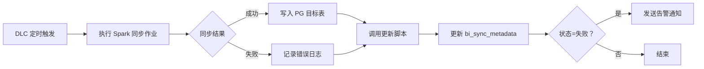
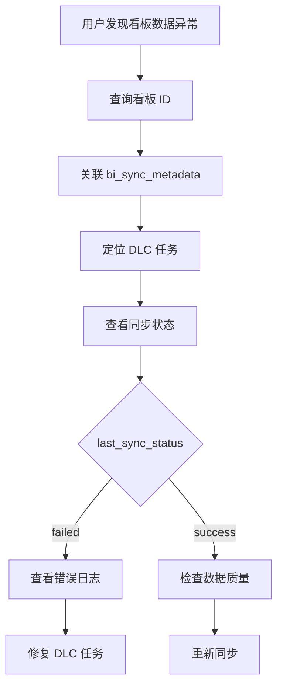

# BI 数据同步任务管理技术方案

## 文档信息

| 项目 | 说明 |
|------|------|
| 文档版本 | 1.0 |
| 创建日期 | 2026-03-06 |
| 文档状态 | 评审中 |
| 适用范围 | DLC 数据湖 → PostgreSQL 同步任务管理 |

## 修订历史

| 版本 | 日期 | 修订人 | 修订说明 |
|------|------|--------|----------|
| 1.0 | 2026-03-06 | - | 初稿，DLC 任务与 Superset 数据集关联管理方案 |

---

## 目录

| 章节 | 内容 |
|------|------|
| 1. 概述 | 背景、目标、范围 |
| 2. 总体设计 | 架构、元数据模型 |
| 3. 详细设计 | 表结构、初始化数据、API 接口 |
| 4. 集成方案 | DLC 集成、Superset 集成 |
| 5. 监控与告警 | 监控指标、看板 SQL |
| 6. 实施计划 | 阶段与里程碑 |
| 附录 A：脚本示例 | 同步更新、健康检查脚本 |

---

## 1. 概述

### 1.1 背景

当前 BI 展示系统存在以下管理痛点：

| 问题 | 影响 |
|------|------|
| **任务与数据集关系不透明** | DLC 同步任务与 PG 表、Superset 数据集之间无关联记录，排查问题困难 |
| **同步状态不可见** | 无法直观查看各看板数据源的同步时间、成功/失败状态 |
| **缺乏统一元数据** | 新看板实施时需人工梳理任务→表→数据集→看板的依赖链 |
| **故障恢复慢** | 同步失败时无自动通知，依赖人工发现 |

### 1.2 目标

- **建立元数据映射**：记录 DLC 任务 → PG 表 → Superset 数据集 → 看板的完整链路
- **自动化状态跟踪**：DLC 任务完成后自动更新同步状态与时间
- **可视化监控**：提供同步健康度看板，支持告警通知
- **零额外成本**：无需独立调度系统，复用现有 PG 数据库

### 1.3 范围

| 纳入管理 | 不纳入管理 |
|---------|-----------|
| DLC → PG 的聚合表同步任务 | PG 内部的数据转换 |
| 4 个 BI 看板的数据源（DB01~DB04） | Superset 内部的数据集配置 |
| 同步状态监控与告警 | DLC 任务调度本身（由 DLC 负责） |

---

## 2. 总体设计

### 2.1 架构设计

```
┌─────────────────┐     ┌──────────────────┐     ┌─────────────────┐
│   DLC 任务层     │     │   元数据管理层    │     │   展示层         │
│                 │     │                  │     │                 │
│  ┌───────────┐  │     │  ┌────────────┐  │     │  ┌───────────┐  │
│  │ 采集瓦片  │──┼─────┼─►│ bi_sync_   │──┼─────┼─►│ Superset  │  │
│  │ 聚合作业  │  │     │  │ metadata   │  │     │  │ 看板      │  │
│  └───────────┘  │     │  └────────────┘  │     │  └───────────┘  │
│                 │     │                  │     │                 │
│  ┌───────────┐  │     │  ┌────────────┐  │     │  ┌───────────┐  │
│  │ 道路长度  │──┼─────┼─►│  状态更新   │──┼─────┼─►│ 监控看板  │  │
│  │ 聚合作业  │  │     │  │   脚本      │  │     │  │          │  │
│  └───────────┘  │     │  └────────────┘  │     │  └───────────┘  │
│                 │     │                  │     │                 │
└─────────────────┘     └──────────────────┘     └─────────────────┘
         │                        │                        │
         │                        │                        │
         ▼                        ▼                        ▼
    Iceberg 表              PostgreSQL              业务前端
```

### 2.2 核心流程

#### 2.2.1 同步任务执行流程



#### 2.2.2 数据依赖追溯流程



---

## 3. 详细设计

### 3.1 元数据表结构

```sql
-- DLC 任务与数据集映射表
CREATE TABLE bi_sync_metadata (
    id                  SERIAL PRIMARY KEY,

    -- DLC 任务信息
    dlc_job_id          VARCHAR(128) NOT NULL COMMENT 'DLC 作业唯一标识',
    dlc_job_name        VARCHAR(255) COMMENT 'DLC 作业名称',
    dlc_table_path      VARCHAR(512) COMMENT 'Iceberg 表路径，如 iceberg://crawler/table',

    -- PG 目标表
    target_schema       VARCHAR(128) DEFAULT 'public' COMMENT '目标 schema',
    target_table        VARCHAR(128) NOT NULL COMMENT '目标表名',

    -- Superset 数据集
    superset_dataset_id INTEGER COMMENT 'Superset 数据集 ID',
    superset_dataset_name VARCHAR(255) COMMENT 'Superset 数据集名称',

    -- 同步配置
    sync_frequency      VARCHAR(20) COMMENT '同步频率：daily, monthly, once',
    sync_type           VARCHAR(20) COMMENT '同步类型：full, incremental',
    partition_column    VARCHAR(64) COMMENT '分区字段：dt, mo, date_refreshed',

    -- 关联的看板
    dashboard_ids       INTEGER[] COMMENT '关联的看板 ID 列表',

    -- 状态与监控
    last_sync_time      TIMESTAMP COMMENT '最后同步时间',
    last_sync_status    VARCHAR(20) COMMENT '最后同步状态：success, failed, running',
    last_sync_rows      BIGINT COMMENT '最后同步行数',
    next_scheduled_time TIMESTAMP COMMENT '下次计划执行时间',
    is_active           BOOLEAN DEFAULT true COMMENT '是否启用',

    -- 元数据
    created_at          TIMESTAMP DEFAULT CURRENT_TIMESTAMP,
    updated_at          TIMESTAMP DEFAULT CURRENT_TIMESTAMP,
    remark              TEXT,

    UNIQUE(dlc_job_id, target_table)
);

-- 索引
CREATE INDEX idx_bi_sync_target ON bi_sync_metadata(target_schema, target_table);
CREATE INDEX idx_bi_sync_dataset ON bi_sync_metadata(superset_dataset_id);
CREATE INDEX idx_bi_sync_active ON bi_sync_metadata(is_active) WHERE is_active = true;
CREATE INDEX idx_bi_sync_status ON bi_sync_metadata(last_sync_status);

-- 注释
COMMENT ON TABLE bi_sync_metadata IS 'DLC 同步任务与 Superset 数据集映射表';
```

### 3.2 初始化数据

#### 3.2.1 4 个看板的数据集映射

```sql
-- DB01: 瓦片采集覆盖总览 (Dashboard 18)
INSERT INTO bi_sync_metadata (
    dlc_job_id, dlc_job_name, dlc_table_path,
    target_schema, target_table,
    superset_dataset_id, superset_dataset_name,
    sync_frequency, sync_type, partition_column,
    dashboard_ids, remark
) VALUES
('dlc_crawler_tile_all', '采集瓦片聚合', 'iceberg://crawler/crawler_tile_all',
 'public', 'crawler_tile_all',
 69, 'ds_db01_coverage_world_map',
 'daily', 'incremental', 'dt',
 ARRAY[18], 'DB01 核心数据源，按日增量同步'),

('dlc_crawler_tile_detail', '采集瓦片明细', 'iceberg://crawler/crawler_tile_detail',
 'public', 'crawler_tile_detail',
 NULL, NULL,
 'daily', 'incremental', 'dt',
 ARRAY[18], '区县级别热力支持（待开发）');


-- DB02: 道路采集覆盖总览 (Dashboard 19)
INSERT INTO bi_sync_metadata (
    dlc_job_id, dlc_job_name, dlc_table_path,
    target_schema, target_table,
    superset_dataset_id, superset_dataset_name,
    sync_frequency, sync_type, partition_column,
    dashboard_ids, remark
) VALUES
('dlc_app_osm_road_length', 'OSM 道路长度聚合', 'iceberg://crawler/app_osm_road_length',
 'public', 'app_osm_road_length',
 70, 'ds_road_coverage_world_map',
 'monthly', 'incremental', 'mo',
 ARRAY[19], '道路长度统计，按月增量同步'),

('dlc_app_osm_road_length_all', 'OSM 道路全量聚合', 'iceberg://crawler/app_osm_road_length_all',
 'public', 'app_osm_road_length_all',
 NULL, NULL,
 'monthly', 'incremental', 'mo',
 ARRAY[19], '道路全量趋势');


-- DB03: POI 采集覆盖总览 (Dashboard 20)
INSERT INTO bi_sync_metadata (
    dlc_job_id, dlc_job_name, dlc_table_path,
    target_schema, target_table,
    superset_dataset_id, superset_dataset_name,
    sync_frequency, sync_type, partition_column,
    dashboard_ids, remark
) VALUES
('dlc_app_foursquare_places', 'Foursquare POI 聚合', 'iceberg://crawler/app_foursquare_places_d',
 'public', 'app_foursquare_places_d',
 71, 'ds_poi_coverage_world_map',
 'daily', 'incremental', 'date_refreshed',
 ARRAY[20], 'POI 统计，按日增量同步');


-- DB04: 人口与综合指标 (Dashboard 22)
INSERT INTO bi_sync_metadata (
    dlc_job_id, dlc_job_name, dlc_table_path,
    target_schema, target_table,
    superset_dataset_id, superset_dataset_name,
    sync_frequency, sync_type, partition_column,
    dashboard_ids, remark
) VALUES
('dlc_dw_osm_population', 'OSM 人口信息聚合', 'iceberg://crawler/dw_osm_population_info',
 'public', 'dw_osm_population_info',
 72, 'ds_population_coverage_world_map',
 'once', 'full', NULL,
 ARRAY[22], '人口数据，一次性全量同步');
```

#### 3.2.2 维表映射（一次性同步）

```sql
INSERT INTO bi_sync_metadata (
    dlc_job_id, dlc_job_name, dlc_table_path,
    target_schema, target_table,
    sync_frequency, sync_type,
    dashboard_ids, remark
) VALUES
('dlc_dim_country', '国家维度表', 'iceberg://dim/dim_country',
 'public', 'dim_country',
 'once', 'full',
 ARRAY[18, 19, 20, 22], '国家维度，所有看板共用'),

('dlc_dim_osm_country_relation', 'OSM 国家关系', 'iceberg://dim/dim_osm_country_relation',
 'public', 'dim_osm_country_relation',
 'once', 'full',
 ARRAY[18, 19, 20, 22], '行政层级关系');
```

### 3.3 API 接口设计

#### 3.3.1 状态更新接口

```python
# API: POST /api/v1/bi/sync/status
# 请求体:
{
    "dlc_job_id": "dlc_crawler_tile_all",
    "status": "success",  # success | failed
    "rows_affected": 149,
    "error_message": null,
    "sync_duration_seconds": 120
}

# 响应:
{
    "code": 0,
    "message": "OK",
    "data": {
        "id": 1,
        "last_sync_time": "2026-03-06T10:30:00Z",
        "last_sync_status": "success",
        "next_scheduled_time": "2026-03-07T00:00:00Z"
    }
}
```

#### 3.3.2 查询接口

```python
# API: GET /api/v1/bi/sync/jobs
# 查询参数:
#   - dashboard_id: 看板 ID（可选）
#   - status: 同步状态（可选）
#   - page, page_size: 分页

# 响应:
{
    "code": 0,
    "message": "OK",
    "data": {
        "total": 7,
        "items": [
            {
                "id": 1,
                "dlc_job_id": "dlc_crawler_tile_all",
                "dlc_job_name": "采集瓦片聚合",
                "target_table": "crawler_tile_all",
                "superset_dataset_id": 69,
                "dashboard_ids": [18],
                "sync_frequency": "daily",
                "last_sync_time": "2026-03-06T10:30:00Z",
                "last_sync_status": "success",
                "health_status": "healthy"  # healthy | warning | critical
            }
        ]
    }
}
```

---

## 4. 集成方案

### 4.1 DLC 集成

#### 4.1.1 DLC 作业完成回调

```python
# DLC 作业脚本末尾添加回调
import requests
import logging

logger = logging.getLogger(__name__)

def notify_sync_status(job_id, status, rows=0, error_msg=None, duration=0):
    """通知同步状态到元数据管理服务"""
    url = "https://your-api-domain.com/api/v1/bi/sync/status"

    payload = {
        "dlc_job_id": job_id,
        "status": status,
        "rows_affected": rows,
        "error_message": error_msg,
        "sync_duration_seconds": duration
    }

    try:
        resp = requests.post(url, json=payload, timeout=10)
        if resp.status_code == 200:
            logger.info(f"✓ Notified sync status: {job_id} -> {status}")
        else:
            logger.error(f"✗ Failed to notify: {resp.text}")
    except Exception as e:
        logger.error(f"✗ Exception notifying status: {e}")

# 在 DLC 作业中使用
if __name__ == '__main__':
    start_time = time.time()
    try:
        # 执行同步逻辑
        rows = sync_to_pg(...)
        notify_sync_status('dlc_crawler_tile_all', 'success', rows=rows, duration=int(time.time()-start_time))
    except Exception as e:
        notify_sync_status('dlc_crawler_tile_all', 'failed', error_msg=str(e), duration=int(time.time()-start_time))
        raise
```

#### 4.1.2 腾讯云 DLC 作业配置示例

```json
{
    "name": "采集瓦片聚合",
    "type": "SPARK",
    "config": {
        "mainClass": "com.maptech.bi.CrawlerTileSync",
        "args": [
            "--source", "iceberg://crawler/crawler_tile_all",
            "--target", "postgresql://crawler_db/crawler_tile_all",
            "--partition", "dt",
            "--mode", "incremental"
        ]
    },
    "schedule": {
        "cron": "0 2 * * *",
        "timezone": "Asia/Shanghai"
    },
    "notification": {
        "onSuccess": {
            "webhook": "https://your-api-domain.com/api/v1/bi/sync/status",
            "body": {
                "dlc_job_id": "dlc_crawler_tile_all",
                "status": "success",
                "rows_affected": "${spark.job.rowsWritten}",
                "sync_duration_seconds": "${spark.job.duration}"
            }
        },
        "onFailure": {
            "webhook": "https://your-api-domain.com/api/v1/bi/sync/status",
            "body": {
                "dlc_job_id": "dlc_crawler_tile_all",
                "status": "failed",
                "error_message": "${spark.job.failureReason}"
            }
        }
    }
}
```

### 4.2 Superset 集成

#### 4.2.1 数据集元数据同步脚本

```python
# scripts/sync_superset_datasets.py
#!/usr/bin/env python3
"""
定期从 Superset API 同步数据集信息到元数据表
保持 superset_dataset_id 和 superset_dataset_name 最新
"""

import requests
import psycopg2
from requests.auth import HTTPBasicAuth
from datetime import datetime

SUPERSET_URL = "https://superset.your-domain.com"
SUPERSET_USER = "api-user"
SUPERSET_PASSWORD = "api-password"

PG_HOST = "your-pg-host"
PG_DB = "crawler_db"
PG_USER = "your-user"
PG_PASSWORD = "your-password"

def fetch_superset_datasets():
    """获取所有数据集"""
    datasets = []
    page = 0
    while True:
        resp = requests.get(
            f"{SUPERSET_URL}/api/v1/dataset/",
            auth=HTTPBasicAuth(SUPERSET_USER, SUPERSET_PASSWORD),
            params={'page': page, 'page_size': 100}
        )
        result = resp.json()
        datasets.extend(result.get('result', []))
        if len(result.get('result', [])) < 100:
            break
        page += 1
    return datasets

def update_metadata(datasets):
    """更新元数据表"""
    conn = psycopg2.connect(
        host=PG_HOST,
        database=PG_DB,
        user=PG_USER,
        password=PG_PASSWORD
    )
    cur = conn.cursor()

    updated = 0
    for ds in datasets:
        ds_id = ds['id']
        ds_name = ds.get('table_name') or ds.get('name', '')

        # 查找匹配的目标表
        cur.execute("""
            UPDATE bi_sync_metadata
            SET superset_dataset_id = %s,
                superset_dataset_name = %s,
                updated_at = %s
            WHERE (target_table = %s OR target_table LIKE %s)
              AND (superset_dataset_id IS NULL OR superset_dataset_id != %s)
        """, (ds_id, ds_name, datetime.now(),
              ds_name.replace('ds_', ''), f'%{ds_name}%', ds_id))

        updated += cur.rowcount

    conn.commit()
    cur.close()
    conn.close()
    print(f"✓ Updated {updated} metadata records")

if __name__ == '__main__':
    datasets = fetch_superset_datasets()
    print(f"Fetched {len(datasets)} datasets from Superset")
    update_metadata(datasets)
```

#### 4.2.2 定时任务配置

```bash
# crontab -e
# 每天凌晨 3 点同步 Superset 数据集元数据
0 3 * * * /usr/bin/python3 /path/to/scripts/sync_superset_datasets.py >> /var/log/bi_sync.log 2>&1
```

---

## 5. 监控与告警

### 5.1 监控指标

| 指标 | 计算方式 | 告警阈值 |
|------|---------|---------|
| 同步成功率 | `成功次数 / 总次数` | < 95% |
| 数据新鲜度 | `NOW() - last_sync_time` | > 2 * sync_frequency |
| 失败任务数 | `COUNT WHERE status='failed'` | > 0 |
| 同步延迟 | `last_sync_time - next_scheduled_time` | > 1 小时 |

### 5.2 监控看板 SQL

#### 5.2.1 同步健康度总览

```sql
-- 看板：BI 同步健康度总览
SELECT
    CASE
        WHEN last_sync_status = 'success'
             AND last_sync_time > NOW() - INTERVAL '2 days'
        THEN '🟢 正常'
        WHEN last_sync_status = 'failed'
        THEN '🔴 失败'
        WHEN last_sync_time < NOW() - INTERVAL '2 days'
        THEN '🟡 超时'
        ELSE '⚪ 未知'
    END as health_status,
    COUNT(*) as job_count
FROM bi_sync_metadata
WHERE is_active = true
GROUP BY 1
ORDER BY 1;
```

#### 5.2.2 看板数据源状态

```sql
-- 看板：各 BI 看板数据源状态
SELECT
    d.dashboard_id,
    COUNT(*) as dataset_count,
    COUNT(*) FILTER (WHERE m.last_sync_status = 'success') as synced_count,
    COUNT(*) FILTER (WHERE m.last_sync_status = 'failed') as failed_count,
    MAX(m.last_sync_time) as last_update,
    CASE
        WHEN COUNT(*) FILTER (WHERE m.last_sync_status = 'failed') > 0
        THEN '⚠️ 有失败任务'
        WHEN MAX(m.last_sync_time) < NOW() - INTERVAL '2 days'
        THEN '⚠️ 数据陈旧'
        ELSE '✅ 正常'
    END as board_status
FROM bi_sync_metadata m
CROSS JOIN UNNEST(m.dashboard_ids) as d(dashboard_id)
WHERE m.is_active = true
GROUP BY 1
ORDER BY 1;
```

#### 5.2.3 待处理告警

```sql
-- 看板：待处理告警列表
SELECT
    dlc_job_name,
    target_table,
    sync_frequency,
    last_sync_time,
    last_sync_status,
    NOW() - last_sync_time as time_since_sync,
    remark
FROM bi_sync_metadata
WHERE is_active = true
  AND (
      last_sync_status = 'failed'
      OR (sync_frequency = 'daily' AND last_sync_time < NOW() - INTERVAL '2 days')
      OR (sync_frequency = 'monthly' AND last_sync_time < NOW() - INTERVAL '35 days')
  )
ORDER BY
    CASE last_sync_status WHEN 'failed' THEN 0 ELSE 1 END,
    last_sync_time;
```

### 5.3 告警通知

#### 5.3.1 企业微信机器人

```python
# scripts/send_wechat_alert.py
#!/usr/bin/env python3
"""
发送同步失败告警到企业微信群
"""

import requests
import psycopg2
from datetime import datetime

WEBHOOK_URL = "https://qyapi.weixin.qq.com/cgi-bin/webhook/send?key=YOUR_KEY"

def fetch_failed_jobs():
    """获取失败的同步任务"""
    conn = psycopg2.connect(
        host="your-pg-host",
        database="crawler_db",
        user="your-user",
        password="your-password"
    )
    cur = conn.cursor()

    cur.execute("""
        SELECT dlc_job_name, target_table, last_sync_time, remark
        FROM bi_sync_metadata
        WHERE is_active = true
          AND last_sync_status = 'failed'
        ORDER BY last_sync_time DESC
    """)

    jobs = cur.fetchall()
    cur.close()
    conn.close()
    return jobs

def send_alert(jobs):
    """发送告警消息"""
    if not jobs:
        return

    content = f"""## BI 数据同步告警

共 {len(jobs)} 个任务同步失败：

"""
    for job in jobs:
        content += f"""- **{job[0]}** ({job[1]})
  最后同步：{job[2]}
  说明：{job[3]}

"""

    payload = {
        "msgtype": "markdown",
        "markdown": {
            "content": content
        }
    }

    resp = requests.post(WEBHOOK_URL, json=payload)
    if resp.status_code == 200:
        print(f"✓ Alert sent for {len(jobs)} failed jobs")
    else:
        print(f"✗ Failed to send alert: {resp.text}")

if __name__ == '__main__':
    jobs = fetch_failed_jobs()
    send_alert(jobs)
```

#### 5.3.2 定时告警任务

```bash
# crontab -e
# 每 30 分钟检查一次同步失败任务
*/30 * * * * /usr/bin/python3 /path/to/scripts/send_wechat_alert.py >> /var/log/bi_alert.log 2>&1
```

---

## 6. 实施计划

### 6.1 阶段划分

| 阶段 | 内容 | 预计工时 | 负责人 |
|------|------|---------|--------|
| **P0** | 创建 `bi_sync_metadata` 表 | 0.5 天 | DBA |
| **P1** | 初始化 4 个看板映射数据 | 0.5 天 | BI 开发 |
| **P2** | 开发状态更新 API | 1 天 | 后端开发 |
| **P3** | DLC 作业集成回调 | 1 天 | 数据开发 |
| **P4** | 监控看板配置 | 1 天 | BI 开发 |
| **P5** | 告警通知集成 | 0.5 天 | 运维 |

### 6.2 里程碑

| 里程碑 | 验收标准 | 预计完成时间 |
|--------|---------|-------------|
| M1: 元数据表就绪 | 表结构创建完成，初始化数据导入 | 2026-03-08 |
| M2: 状态更新可用 | DLC 作业可正常回调更新状态 | 2026-03-10 |
| M3: 监控看板上架 | 可在 Superset 查看同步健康度 | 2026-03-12 |
| M4: 告警通知运行 | 失败任务可自动推送企业微信 | 2026-03-13 |

---

## 附录 A：脚本示例

### A.1 健康检查脚本

```python
#!/usr/bin/env python3
# scripts/health_check.py

import psycopg2
from datetime import datetime
import sys

def check_health():
    conn = psycopg2.connect(
        host="your-pg-host",
        database="crawler_db",
        user="your-user",
        password="your-password"
    )
    cur = conn.cursor()

    # 检查失败任务
    cur.execute("""
        SELECT COUNT(*) FROM bi_sync_metadata
        WHERE is_active = true AND last_sync_status = 'failed'
    """)
    failed_count = cur.fetchone()[0]

    # 检查超时任务
    cur.execute("""
        SELECT COUNT(*) FROM bi_sync_metadata
        WHERE is_active = true
          AND sync_frequency = 'daily'
          AND last_sync_time < NOW() - INTERVAL '2 days'
    """)
    overdue_count = cur.fetchone()[0]

    cur.close()
    conn.close()

    if failed_count > 0 or overdue_count > 0:
        print(f"❌ Health check failed: {failed_count} failed, {overdue_count} overdue")
        sys.exit(1)
    else:
        print("✅ All sync jobs are healthy")
        sys.exit(0)

if __name__ == '__main__':
    check_health()
```

### A.2 数据新鲜度报告

```python
#!/usr/bin/env python3
# scripts/freshness_report.py

import psycopg2
from datetime import datetime

def generate_report():
    conn = psycopg2.connect(
        host="your-pg-host",
        database="crawler_db",
        user="your-user",
        password="your-password"
    )
    cur = conn.cursor()

    cur.execute("""
        SELECT
            dlc_job_name,
            target_table,
            sync_frequency,
            last_sync_time,
            CASE
                WHEN sync_frequency = 'daily' THEN '每日'
                WHEN sync_frequency = 'monthly' THEN '每月'
                WHEN sync_frequency = 'once' THEN '一次性'
                ELSE sync_frequency
            END as freq_cn,
            AGE(NOW(), last_sync_time) as time_ago
        FROM bi_sync_metadata
        WHERE is_active = true
        ORDER BY last_sync_time DESC
    """)

    print("BI 数据同步新鲜度报告")
    print("=" * 80)
    print(f"{'任务名称':<20} {'目标表':<25} {'频率':<8} {'最后同步':<20} {'距今':<10}")
    print("-" * 80)

    for row in cur.fetchall():
        print(f"{row[0]:<20} {row[1]:<25} {row[4]:<8} {str(row[3] or 'N/A'):<20} {str(row[5] or 'N/A'):<10}")

    cur.close()
    conn.close()

if __name__ == '__main__':
    generate_report()
```

---

## 附录 B：常见问题

### B.1 如何添加新看板？

1. 在 `bi_sync_metadata` 表 INSERT 新记录
2. 配置对应的 DLC 作业
3. 在 DLC 作业中集成状态回调

### B.2 如何处理同步失败重试？

DLC 侧配置重试策略，元数据表记录最终状态。可在 Superset 看板配置刷新按钮，手动触发重跑。

### B.3 如何对接 Airflow/DolphinScheduler？

将 `bi_sync_metadata` 表作为 Airflow 的 Hook 数据源，使用 `PostgresOperator` 更新状态字段。
